# 微信客服接入智谱清言智能体

## 简介

本项目是一个将微信客服快速接入智谱清言智能体的项目。它可以帮助您将智谱清言智能体集成到您的微信客服系统中，在微信原生体验下为用户带来便捷的智能体交互。

## 部署

你可以选择Docker或原生部署两种方式。

### Docker部署

```shell
# 拉取镜像，如果镜像源dockerproxy.cn拉不动可以换别的
docker pull dockerproxy.cn/vinlic/wxkf-api
```

建立一个空目录，下载仓库中的以下四个文件到目录中：

`agents.yml.template`、`secret.yml.template`、`startup-docker.sh`、`shutdown-docker.sh`

```shell
# 重命名智能体配置文件
mv agents.yml.template agents.yml
# 重命名secret配置文件
mv secret.yml.template secret.yml
# 授予脚本执行权限
chmod u+x startup-docker.sh shutdown-docker.sh
# 运行容器并显示日志
./startup-docker.sh
# 查看服务日志
docker logs -f wxkf-api
# 看到输出的日志中出现【STEP1】的警告代表初步部署完成，请继续往下
```

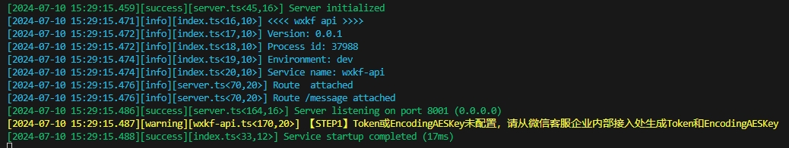

### 原生部署

首先，您需要安装Node.js 18+。然后，您可以使用以下命令在项目根目录安装依赖和构建部署：

```bash
# 确认Node版本是否在18以上
node -v
# 全局安装PM2进程管理器
npm install pm2 -g --registry https://registry.npmmirror.com
# 安装依赖
npm install --registry https://registry.npmmirror.com
# 编译构建
npm run build
# 重命名智能体配置文件
mv agents.yml.template agents.yml
# 重命名secret配置文件
mv secret.yml.template secret.yml
# 启动服务
pm2 start dist/index.js --name "wxkf-api"
# 查看服务日志
pm2 logs wxkf-api
# 看到输出的日志中出现【STEP1】的警告代表初步部署完成，请继续往下
```


## 启用微信客服

前往微信客服（[https://kf.weixin.qq.com/](https://kf.weixin.qq.com/)）扫码登录（首先你得是企业微信管理员）。

进入开发配置选项，点击“开始使用”启用企业内部接入。

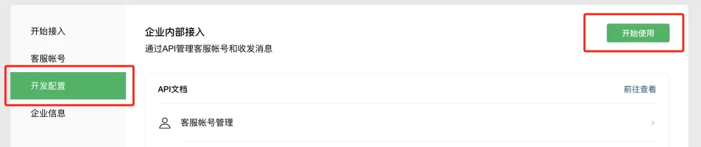

回调地址请填写 [https://example.com/message/notify](https://example.com/message/notify)（域名请替换为你的，如果你没有域名请替换为IP地址和端口同时协议改为http，地址是指向本服务部署地址）。

Token和EncodingAESKey可以自行填写或随机生成并保留记录。

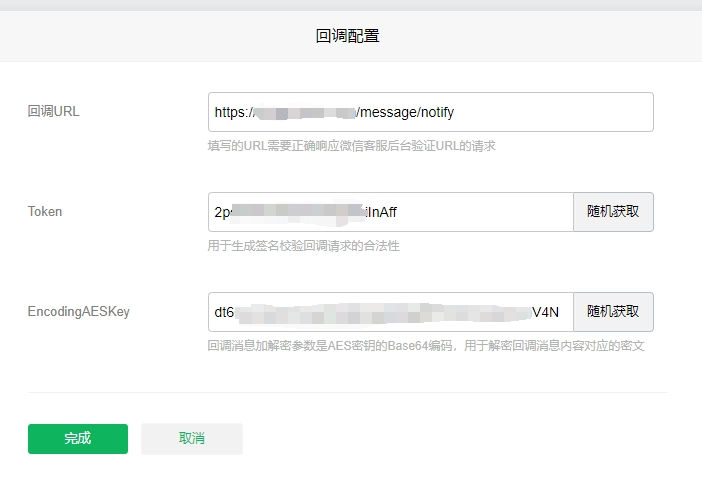

## 验证服务器回调

在secret.yml中先配置您的Token和EncodingAESKey并保存重启。

```yaml
# 企业ID
WXKF_API_CORP_ID: "default"
# Secret
WXKF_API_CORP_SECRET: "default"
# Token
WXKF_API_TOKEN: "填写你的Token"
# EncodingAESKey
WXKF_API_ENCODING_AES_KEY: "填写你的EncodingAESKey"
```

```shell
# Docker部署重启方式
./shutdown-docker.sh
./startup-docker.sh
# 查看服务日志
docker logs -f wxkf-api
# 看到输出的日志中出现【STEP2】的警告代表第一步完成，请继续往下
```

```shell
# 原生部署重启方式
pm2 reload wxkf-api
# 查看服务日志
pm2 logs wxkf-api
# 看到输出的日志中出现【STEP2】的警告代表第一步完成，请继续往下
```

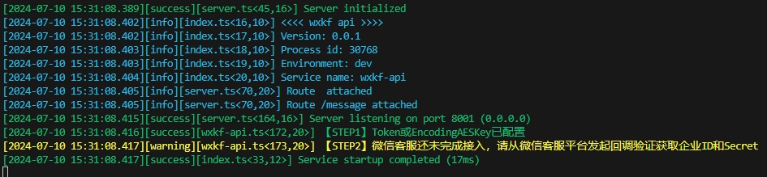


点击“完成”按钮，完成服务器回调的验证。

验证通过后会进入以下界面：

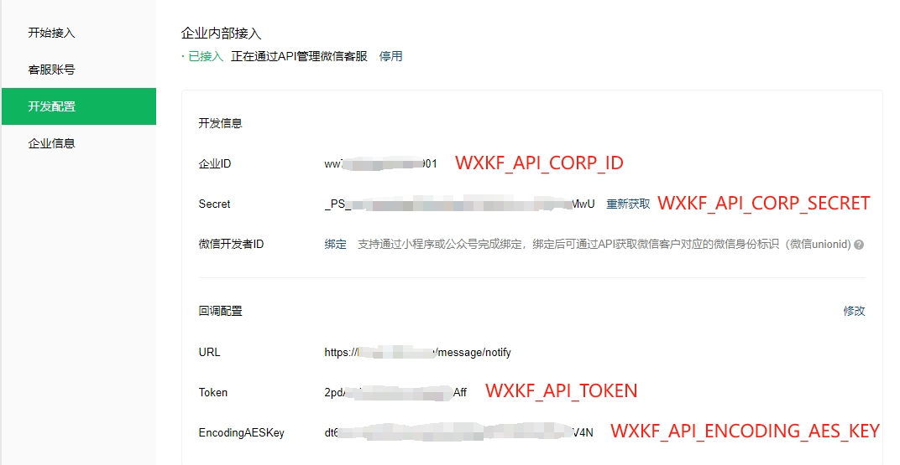

请根据标识配置到您的secret.yml文件中，并再次重启。

```yaml
# 企业ID
WXKF_API_CORP_ID: "填写你的企业ID"
# Secret
WXKF_API_CORP_SECRET: "填写你的Secret"
# Token
WXKF_API_TOKEN: "填写你的Token"
# EncodingAESKey
WXKF_API_ENCODING_AES_KEY: "填写你的EncodingAESKey"
```

```shell
# Docker部署重启方式
./shutdown-docker.sh
./startup-docker.sh
# 查看服务日志
docker logs -f wxkf-api
# 看到输出的日志中没有出现错误即可，请继续往下
```

```shell
# 原生部署重启方式
pm2 reload wxkf-api
# 查看服务日志
pm2 logs wxkf-api
# 看到输出的日志中没有出现错误即可，请继续往下
```

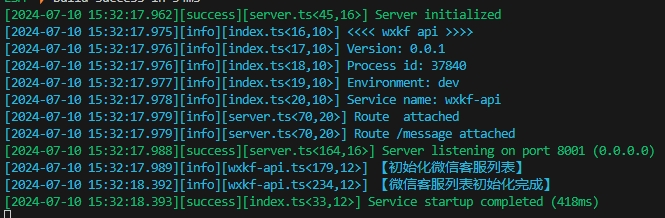

## 配置智能体

按照以下说明配置您的智能体。

先前往[智能体中心](https://chatglm.cn/main/toolsCenter)选用您自己已发布的智能体，或者他人已发布的智能体（仅网页API接入可用）。

配置完毕后请再次重启服务即可。

### 智能体原生API接入方式

先在创作者中心[创建API Key](https://chatglm.cn/developersPanel/apiSet)，然后将key和secret用`.`拼接填入apiKey处。

```yaml
- # 超级MEME智能体
  # 智能体ID（只能使用自己创建的已发布智能体，从智能体页面的地址栏URL尾部获取24位字符）
  id: "667e550c1d0afe6b58f0c4ca"
  # 智能体名称，设定后将作为客服名称
  name: "超级MEME"
  # 接入方式，这里是原生API接入
  api: "qingyan-glms-api"
  # 用.拼接的key和secret
  apiKey: "21a**********9a0.2f****************************37"
  # 首次进入客服的欢迎语，不设置将不发送欢迎语
  welcome: "给我一个词，送你一个meme图！"
  # 最大对话轮数，超出后会自动开启新的会话，默认为8轮，可以根据你的智能体性质来决定
  # 比如聊天类的可以有比较多的轮次，但像这种工具类的为了减少幻觉可能只给一轮
  maxRounds: 1
  # 智能体头像URL，可以在网页上打开智能体页面右击智能体头像复制图片地址获得
  avatarUrl: "https://sfile.chatglm.cn/img2text/5926ade5-d009-45a7-9a2b-94f7c19eae56.jpg"
  # 是否启用智能体，如果禁用会自动回复：抱歉，智能体当前已下线，暂时无法为您提供服务T^T
  enabled: true
```

### 智能体网页API接入方式

先在智谱清言登录，然后从浏览器Cookies中获取`chatglm_refresh_token`值，可以使用Cookie-Editor等浏览器插件辅助获取。

```yaml
- # ChatGLM
  # 智能体ID（从智能体页面的地址栏URL尾部获取24位字符）
  id: "65940acff94777010aa6b796"
  # 智能体名称，设定后将作为客服名称
  name: "ChatGLM"
  # 接入方式，这里是网页API接入
  api: "qingyan-glms-free-api"
  # chatglm_refresh_token的值
  apiKey: "eyJhbGciOiJI..."
  # 首次进入客服的欢迎语，不设置将不发送欢迎语
  welcome: "欢迎使用ChatGLM，让我们一起探索AGI！"
  # 比如聊天类的可以有比较多的轮次，但工具类的为了减少幻觉可能只给一轮
  maxRounds: 10
  # 智能体头像URL，可以在网页上打开智能体页面右击智能体头像复制图片地址获得
  avatarUrl: "https://sfile.chatglm.cn/chatglm4/81a30afa-d5d9-4c9e-9854-dabc64ab2574.png"
  # 是否启用智能体，如果禁用会自动回复：抱歉，智能体当前已下线，暂时无法为您提供服务T^T
  enabled: true
```

## 自动初始化客服

完成以上智能体配置检查无误后重启服务，服务会自动根据配置创建客服账号列表。

```shell
# Docker部署重启方式
./shutdown-docker.sh
./startup-docker.sh
# 查看服务日志
docker logs -f wxkf-api
# 如果日志中显示账号创建成功，即代表完成初始化
```

```shell
# 原生部署重启方式
pm2 reload wxkf-api
# 查看服务日志
pm2 logs wxkf-api
# 如果日志中显示账号创建成功，即代表完成初始化
```

创建后会生成一个客服链接，请复制下来，这个链接可以放到任意需要跳转智能体客服的位置，你也可以将它[分享为卡片](#分享卡片)。

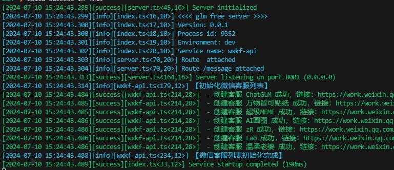

打开微信客服（[https://kf.weixin.qq.com/](https://kf.weixin.qq.com/)）的客服账号，可以看到自动创建好的智能体列表。

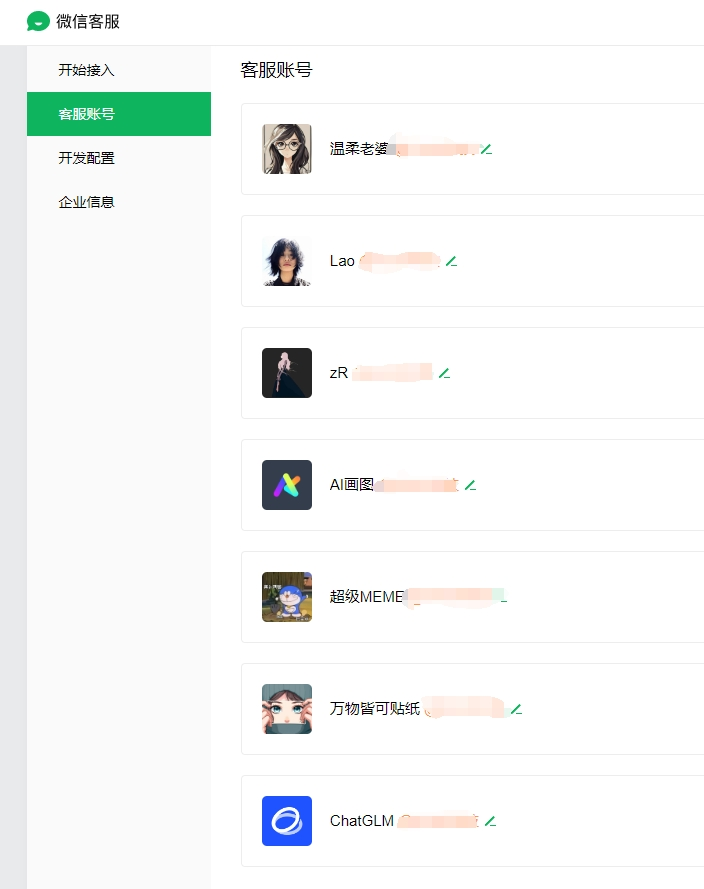

## 验证功能

通过客服链接或卡片进入后，就可以直接与智能体对话了！

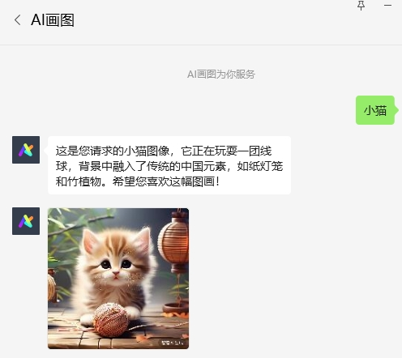

## 分享卡片

你可以将智能体客服分享为卡片。

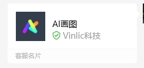

点开客服账号右上角，再点击头像，再点击下图右上角位置即可将智能体客服以卡片形式分享给好友。

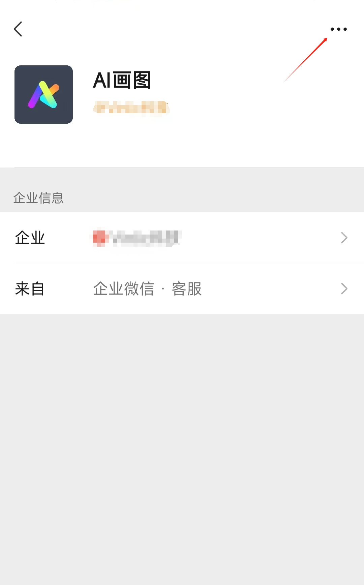
